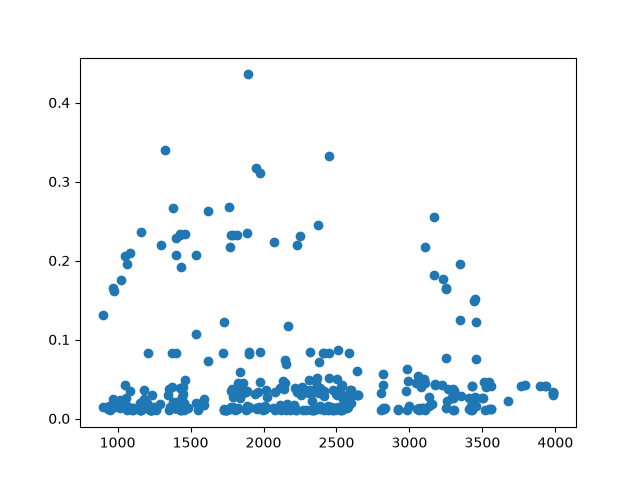
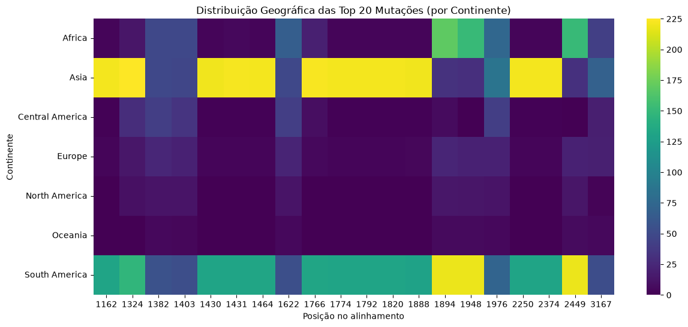
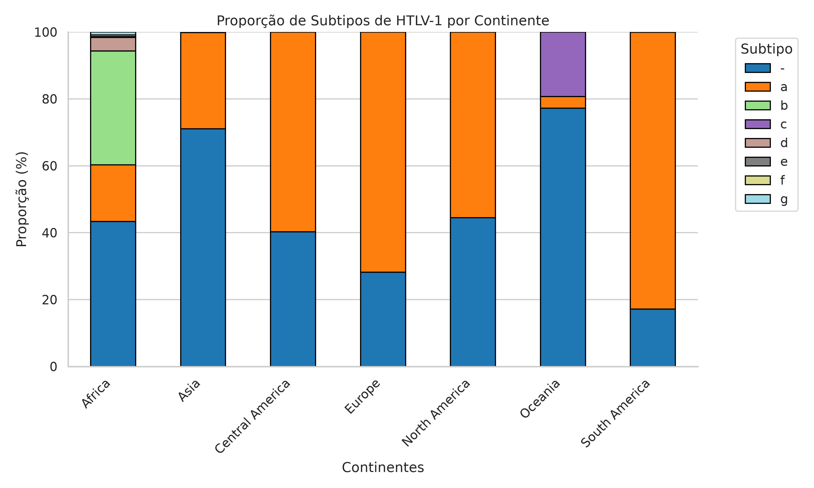

# Relatório de Análise Filogenética e Variabilidade Genômica: Gene env (HTLV)

Projeto: `htlv-genomics-pipeline`
Autor(a): Larissa Jennifer Borba
Gene alvo: env (HTLV-1)

## Visão Geral
**Objetivo**
Este relatório tem como objetivo padronizar o conjunto de dados de sequências do gene *env*(Codifica as glicoproteínas da superfície do vírus que interagem com os receptores das células humanas para permitir a infecção.), realizar o alinhamento multiplo de sequencias (MSA) e garantir homologia posicional. Além disso, construir uma ávore filogenéticade de máxima verossimilhança para mapear clados geográficos e identificar sítios polimórficos e mutações de menor frequência (MAF)

## Metodologia e Pipeline
1. Aquisição de dados atraves do HTLV Database `data/raw/htlv_sequences.fasta` e a tabela de metadados correspondente em `data/raw/metadata.csv`

2. Correção do formato fasta `00_fix_fasta.py`: 
    Foi necessário criar esse script para fazer correções no arquivo bruto de sequencias, pois ao relizar o alinhamento via MAFFT, o arquivo final resultava em 0 bytes por erro de formatação. Com isso, foi realizado esse script para padronizar as sequencias de forma que obtivesse um arquivo com sequencias limpas.
        - padronização: apenas letras A,T,C,G / degraus do IUPAC em maiúsculas. Tambem, padroniza o cabeçalho das sequencias, de forma que cada linha comece com ">" , com é o formato FASTA.

3. Pre-processamento e validação das sequencias:
    3.1 Remoção de sequencias < 600 pb e > 1500 pb, visto que o gene env tem um tamanho entre600 e 1500 pares de base;
    3.2 Remove sequencias sem origem geográfica
    3.3 Remove sequencias repetidas
    3.4 Verifica qualidade das sequencias, de forma que é removido as sequencias que possuirem excesso de bases ambíguas (mais de 1%/5% de letras fora de A, T, C, G)

4. Alinhamento Multiplo de Sequencias `02_align_seq.py`: 
    MSA via MAFFT. Essa parte trata de organizar visualmente as sequencias do HTLV para que a mesma regiao do virus seja comparada exatamente no mesmo ponto em todas as amostras. O alinhamento multiplo insere gaps ("-") para que as sequencias fiquem emparelhadas.

5. Reconstrução e Visualização filogenética
    A reconstrução da árvore filogenética é realizada via **IQ-TREE 2** utilizando o método de Máxima Verossimilhança com suporte de nós por Ultrafast Bootstrap (UFBoot) e enraizamento pelo ponto médio (*midpoint rooting*). `03_run_phylo.py`
    Após testar a plotagem local(`04_plot_tree.py`) e via iTOL, optou-se exclusivamente pelas imagens geradas pelo **iTOL** para compor os resultados finais e figuras de publicação. Vale ressaltar que, para adicionar a origem geográfica das amostras, foi criado o script `05_make_itol_metadata.py`, ou seja, um arquivo baseado na padronização necessario do itol para que a arvore fosse "pintada". 

6. Análise de Variantes 
    Para essa análise foi criado o script `06_analyze_mutations.py` que primeiro verifica se o alinhamento foi correto, ou seja, se todas as sequencias possuem o mesmo tamanho (foi 4704 pb). Esse tamanho é justificado pela inserção de gaps ("-") após o alinhamento pelo MAFFT necessária para que regiões homologas fiquem emparelhadas entre sequências de tamanhos originalmente diferentes. 
    Em seguida, o script analisa todas as posições (colunas) do alinhamento entre as 2.339 sequencias aprovadas, comparando os alelos presentes em cada uma. Posições em que a unica diferença encontrada é um gap são descartadas da análise, já que representam sequências mais curtas ou parciais, e não uma variação biológica real. 
    Para as posições com mais d euma base distinta, o script conta a ocorrência de cada alelo gerando registros como:
         {"posição" : 305, "letras": {"A","C"}, "maf":0.0234}
    
A partir dessa contagem, é calculado o **MAF (Minor Allele Frequency)** — a frequência do alelo menos comum naquela posição. Esse valor é utilizado para diferenciar variações genéticas reais de possível ruído (erro de sequenciamento, amostras isoladas): posições em que o alelo minoritário aparece em menos de 1% das sequências são descartadas, permanecendo na análise final apenas as variações estatisticamente relevantes.

As posições aprovadas são exportadas para `results/tables/htlv_seq_mutations.csv`, e um gráfico de dispersão (Manhattan plot), posição x MAF, é gerado em `results/figures/dispersao_env.png`, permitindo visualizar as regiões do gene *env* com maior concentração de variabilidade genética.

## Resultados Obtidos

**Qualidade do Alinhamento e Sequências**
    Essa validação confirmou 0 sequências com tamanho incorreto entre as 2.339 aprovadas, todas com 4.704 pb (incluindo os gaps inseridos pelo MAFFT). Nenhuma sequência bruta ficou fora do filtro de tamanho definido para o gene "env", confirmando a consistência do pré-processamento realizado nas etapas anteriores.

**Reconstrução Filogenética**

É possível observar que a maioria das amostras tem origem geográfica não definida (cor roxo escuro na legenda). Notavelmente, essas sequências sem metadado geográfico tendem a se agrupar num clado isolado do restante da árvore (visível como um conjunto de ramos sem cor atribuída, já que não constam no arquivo de anotação do iTOL), sugerindo uma origem comum entre elas — possivelmente provenientes de um mesmo lote ou estudo de depósito no GenBank que não preencheu esse campo. Esse padrão de ausência de metadado concentrada num subconjunto específico do dataset também se repete nas demais análises deste relatório (geográfica e de subtipos), reforçando que a falta de dado não é aleatória, mas sistemática em parte da amostra.

Além disso, os ramos coloridos formam blocos relativamente coesos ao longo da árvore, com pouca dispersão de cores dentro de um mesmo clado — indicando que sequências geograficamente próximas tendem também a ser filogeneticamente próximas, consistente com o padrão esperado de dispersão geográfica do vírus.

**Análise de Mutações e Variabilidade**
Das 4.704 posições do alinhamento, 2.962 (62,97%) apresentaram alguma variação entre as sequências antes da aplicação do filtro. Após a padronização de maiúsculas e plicação de filtro do MAF (>=1%), esse numero foi reduzido para 403 posições (8,57%), consideradas mutações relevantes (uma faixa condizente com a diversidade genética esperada para uma amostra global do vírus).
    O Manhattan plot evidencia concentração de picos de MAF em determinada faixa de posições, ou regiões mais conservadas.

Outro observação feita, foi através do heatmap. É possíel observar que a Ásia é a região que tem uma maior quantidade de letra minoritária, ou seja, é a região que apresenta maior variabilidade em posições específicas 1622, 1324, 1430, 1431, 1464, 1766 e etc. Além disso, é possível observar que a África, Europa, Oceania e America do Norte são regiões que menos apresentam variações. Em contrapartida, a America do Sul é a região que possui variabilidade alelica em várias posiões. 
Após analisar a contagem de sequências por região, foi possível eliminar a suspeita de que os resultados da Ásia estavam sendo superestimados por uma maior quantidade de amostras, o que na realidade, não é o caso. A região com maior quantidade de amostras foi a América do Sul (1.008 sequências), que ficou como a segunda região de maior variabilidade no heatmap, atrás da Ásia (733 sequências).
    

Após encontrar artigos relevantes via NCBI/PubMed, foi realizada uma investigação sobre uma discrepância entre o heatmap gerado e a literatura científica: o heatmap mostrava a África com baixa variabilidade genética, enquanto os artigos descrevem justamente o oposto: a África é apontada como a região de maior diversidade genética do HTLV-1, com seis genótipos distintos já identificados (a, b, d, e, f, g).   
Para investigar essa discrepância, foram analisadas as colunas Subtype e Subgroup do metadata, separadamente por continente:
    - Ásia: predominância do subtipo "a" (211 sequências), dividido em dois subgrupos, A (100) e B (65) — uma proporção (~60%/40%) semelhante à relatada entre os subgrupos Transcontinental e Japonês em estudo com amostras de Taiwan (58%/42%).   
    
    - América do Sul: forte predominância do subtipo "a" (834 sequências) e do subgrupo A (716) — baixa diversidade de subtipos, condizente com o esperado para o genótipo Cosmopolita, amplamente disseminado nessa região.   
    
    - África: ao contrário dos outros dois continentes, apareceram 5 subtipos diferentes na mesma amostra — b (149), a (74), d (18), g (4) e f (2) — a maior diversidade de subtipos entre os três continentes analisados.   
    Esse resultado confirma que os dados da África de fato apresentam maior diversidade de subtipos, como descrito na literatura, o que parecia, à primeira vista, contradizer o heatmap. 
    A explicação está em que as duas análises medem coisas diferentes: o heatmap mostra a variação nucleotídica posição a posição, dentro do gene env, enquanto a contagem de subtipos mede quantos genótipos distintos existem na amostra. Ou seja, a África pode abrigar mais genótipos diferentes do vírus (maior diversidade populacional), sem que isso implique, necessariamente, em maior variação interna nas posições específicas do gene env analisadas neste estudo. Além disso, ao analisar o gráfico de barras empilhadas (proporção de subtipos por continente) e cruzar com o heatmap, foi possível observar que:

    - **Ásia e América do Sul:** apesar de apresentarem maior variabilidade em posições específicas do heatmap, apresentam quase exclusivamente o subtipo "a" nas amostras analisadas. Foi possível observar que esse subtipo "a" apresenta posições adjacentes (1766 a 1888) com grande variabilidade alélica, dando a entender que essa região é uma área de alta plasticidade. Em suma, isso mostra uma dinâmica evolutiva própria do gene *env*, indicando uma região sob pressão seletiva ou alta taxa de mutação dentro de uma mesma linhagem.

    - **África:** apresenta o padrão oposto, exibindo pouca variabilidade nucleotídica nas posições analisadas no heatmap, mas uma grande variabilidade de subtipos entre as amostras da região.
